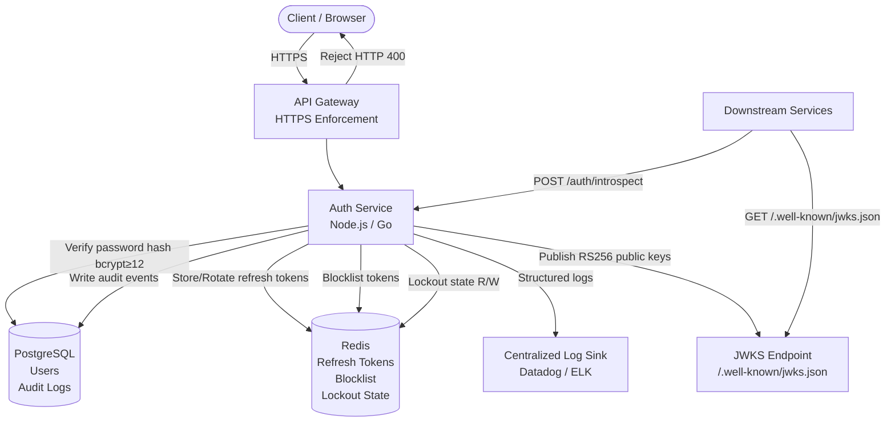

# Architecture Diagram

> Module: Auth | ID: REQ-003

```mermaid
graph TD
    Client([Client / Browser])
    GW[API Gateway\nHTTPS Enforcement]
    AuthSvc[Auth Service\nNode.js / Go]
    Redis[(Redis\nRefresh Tokens\nBlocklist\nLockout State)]
    DB[(PostgreSQL\nUsers\nAudit Logs)]
    JWKS[JWKS Endpoint\n/.well-known/jwks.json]
    LogSink[Centralized Log Sink\nDatadog / ELK]
    DownstreamSvc[Downstream Services]

    Client -->|HTTPS| GW
    GW -->|Reject HTTP 400| Client
    GW --> AuthSvc

    AuthSvc -->|Verify password hash bcrypt≥12| DB
    AuthSvc -->|Store/Rotate refresh tokens| Redis
    AuthSvc -->|Blocklist tokens| Redis
    AuthSvc -->|Lockout state R/W| Redis
    AuthSvc -->|Write audit events| DB
    AuthSvc -->|Structured logs| LogSink
    AuthSvc -->|Publish RS256 public keys| JWKS

    DownstreamSvc -->|POST /auth/introspect| AuthSvc
    DownstreamSvc -->|GET /.well-known/jwks.json| JWKS
```

---
