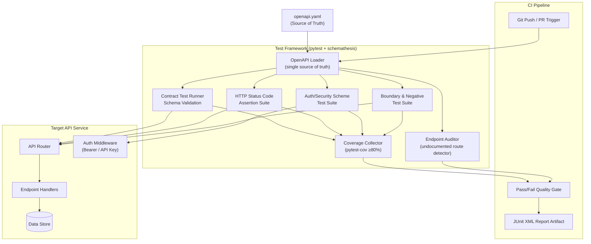

# Architecture Diagram

> Module: test | ID: tst-001

```mermaid
flowchart TD
    subgraph CI["CI Pipeline"]
        trigger["Git Push / PR Trigger"]
        gate["Pass/Fail Quality Gate"]
        report["JUnit XML Report Artifact"]
    end

    subgraph TestFramework["Test Framework (pytest + schemathesis)"]
        loader["OpenAPI Loader\n(single source of truth)"]
        contract["Contract Test Runner\nSchema Validation"]
        status["HTTP Status Code\nAssertion Suite"]
        auth["Auth/Security Scheme\nTest Suite"]
        boundary["Boundary & Negative\nTest Suite"]
        coverage["Coverage Collector\n(pytest-cov ≥80%)"]
        audit["Endpoint Auditor\n(undocumented route detector)"]
    end

    subgraph TargetAPI["Target API Service"]
        router["API Router"]
        handlers["Endpoint Handlers"]
        middleware["Auth Middleware\n(Bearer / API Key)"]
        db[("Data Store")]
    end

    openapi["openapi.yaml\n(Source of Truth)"]

    trigger --> loader
    openapi --> loader
    loader --> contract
    loader --> status
    loader --> auth
    loader --> boundary
    loader --> audit

    contract --> router
    status --> router
    auth --> middleware
    boundary --> router
    router --> handlers
    handlers --> db

    contract --> coverage
    status --> coverage
    auth --> coverage
    boundary --> coverage

    coverage --> gate
    audit --> gate
    gate --> report
```

---
