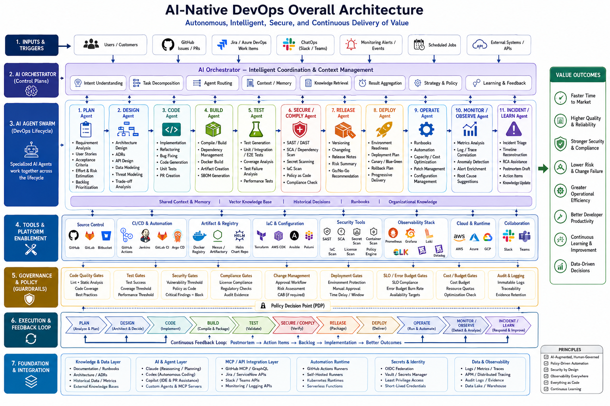

# AI-Native DevOps Overall Architecture



## Architecture Goal

The architecture coordinates multiple AI agents and DevOps tools to automate the software delivery lifecycle while preserving governance, security, and human accountability.

## Layers

### 1. Inputs and Triggers

Common trigger sources:

- Users and customers
- GitHub issues and pull requests
- Jira or Azure DevOps work items
- ChatOps messages from Slack or Teams
- Monitoring alerts and events
- Scheduled jobs
- External systems and APIs

### 2. AI Orchestrator

The orchestrator coordinates intent understanding, task decomposition, agent routing, context retrieval, result aggregation, strategy selection, and learning feedback.

### 3. AI Agent Swarm

Specialized agents handle each DevOps phase:

- Planning Agent
- Design Agent
- Coding Agent
- Build Agent
- Test Agent
- Security Agent
- Release Agent
- Deploy Agent
- Ops Agent
- Observability Agent
- Incident/Learn Agent

### 4. Tools and Platform Enablement

The execution layer includes:

- Source control
- CI/CD automation
- Artifact registry
- Infrastructure as Code
- Security scanners
- Observability tools
- Cloud runtimes
- Collaboration tools

### 5. Governance and Policy Guardrails

Policy gates enforce code quality, testing, security, compliance, deployment, SLO, cost, and audit requirements.

### 6. Execution and Feedback Loop

The lifecycle continuously feeds lessons back into planning and implementation:

```text
Postmortem → Action Items → Backlog → Implementation → Better Outcomes
```

### 7. Foundation and Integration

Required foundations:

- Knowledge and documentation layer
- AI and agent layer
- MCP/API integration layer
- Automation runtime
- Secrets and identity layer
- Data and observability layer

## Key Design Decisions

| Decision | Recommendation |
|---|---|
| AI execution model | Agent-assisted PR workflow first |
| Production deployment | Protected environment with approval |
| Secrets | OIDC, Vault, or cloud IAM; no prompt exposure |
| Knowledge source | Repository docs, runbooks, ADRs, incidents, metrics |
| Safety model | Policy-as-code plus human-governed gates |
