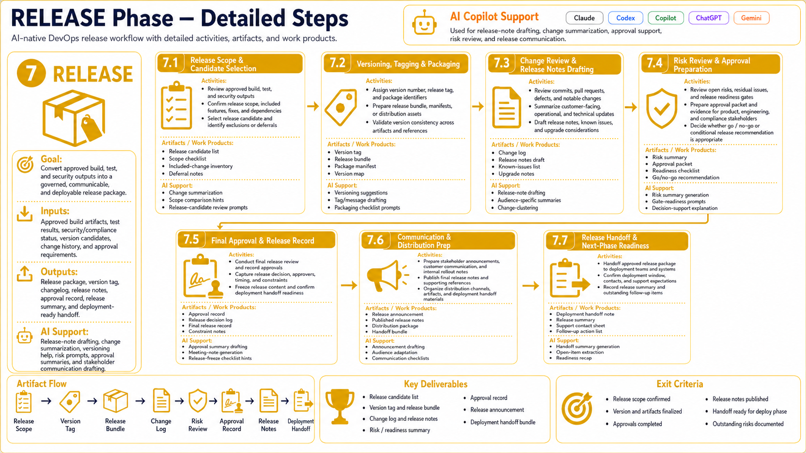

# RELEASE Phase Guidelines



## Objective

The RELEASE phase uses AI agents and deterministic DevOps tooling to improve speed, quality, reliability, and traceability.

## Core Activities

- Versioning
- Changelog generation
- Release notes
- Risk review
- Approval preparation

## Key Artifacts and Work Products

- Version tag
- Release bundle
- Changelog
- Release notes
- Approval record

## How AI Supports This Phase

AI tools such as Claude, Codex, GitHub Copilot, and internal agents should be used to:

1. Summarize context from issues, pull requests, logs, docs, and previous decisions.
2. Generate structured drafts that are easy for humans to review.
3. Identify missing requirements, risks, edge cases, and dependencies.
4. Produce implementation, testing, security, or operational recommendations.
5. Create pull requests only when the scope is clear and policy allows it.
6. Record assumptions and evidence for auditability.

## Recommended Agent Responsibilities

| Agent Type | Responsibility |
|---|---|
| Claude | Reasoning, analysis, documentation, trade-off review |
| Codex | Implementation, refactoring, test generation, CI fixes |
| GitHub Copilot | IDE assistance, PR assistance, repository-native suggestions |
| Internal Agent | Organization-specific automation and tool integration |

## Required Controls

- All changes must be linked to an issue, PR, workflow run, or incident record.
- Production-impacting changes require approval gates.
- Security and compliance exceptions must be documented.
- Generated outputs must be reviewed for correctness and completeness.

## Example Prompt

```text
You are the RELEASE phase AI agent.

Context:
- Repository: <repo>
- Work item: <issue or ticket>
- Relevant docs: <links or excerpts>
- Constraints: <security, compliance, deadlines, compatibility>

Task:
Analyze the current RELEASE phase work and produce:
1. Summary of current state
2. Recommended next steps
3. Risks and missing information
4. Artifacts to create or update
5. Validation checklist
6. Human approval points

Output as structured Markdown.
```

## Exit Criteria

- Required artifacts are complete.
- Quality gates for this phase are satisfied.
- Risks are documented or accepted.
- Handoff to the next phase is clear.
