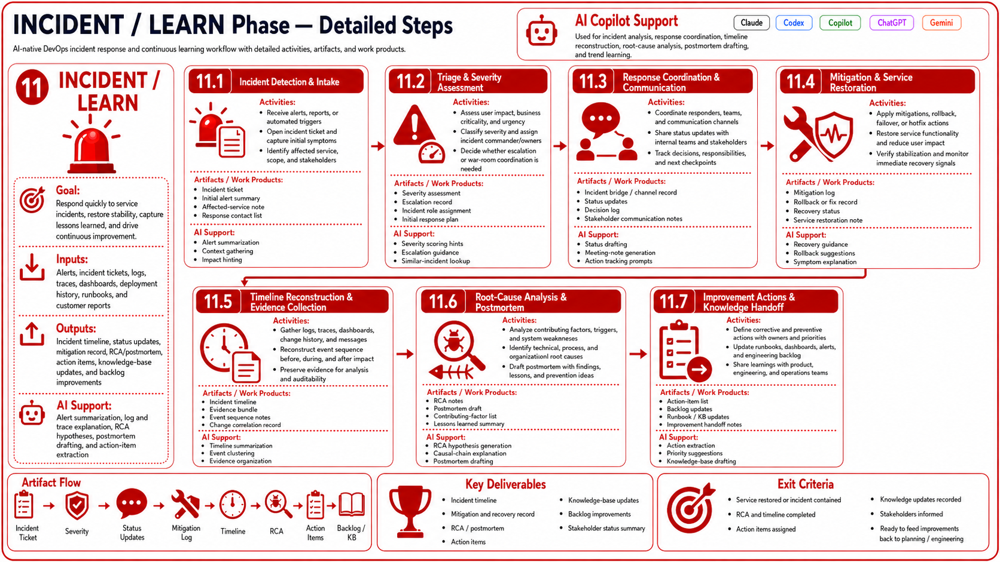

# INCIDENT / LEARN Phase Guidelines

## Objective

The INCIDENT / LEARN phase uses AI agents and deterministic DevOps tooling to improve speed, quality, reliability, and traceability.

# 11 INCIDENT / LEARN Lifecycle Guide

## Phase Objective

Capture the incident, build RCA hypotheses, document lessons learned, and feed follow-up work back into the backlog.

## Repository Directories

- docs/lifecycle
- docs/prompts
- docs/checklists
- docs/agents
- docs/templates
- docs/operations
- docs/workflows

## Mandatory Input Files

- docs/lifecycle/11-incident-learn.md
- docs/prompts/11-incident-learn.md
- docs/checklists/11-incident-learn-checklist.md
- docs/agents/incident-agent.md
- docs/templates/postmortem-template.md

## Required Output Files

- docs/templates/postmortem-template.md
- docs/lifecycle/11-incident-learn.md
- docs/operations/incident-process.md

## Core Activities

- Incident coordination
- Timeline building
- RCA analysis
- Postmortem authoring
- Action item tracking

## Recommended AI Provider

**Claude** — timeline reasoning, causal analysis, structured postmortem writing, and backlog synthesis.

## AI And Automation Expectations

- Build incident timeline and RCA hypotheses from evidence.
- Draft postmortem and communications summary.
- Convert learnings into backlog-ready action items.
- Capture ownership and due dates.

## Controls And Approval Gates

- Preserve factual accuracy and evidence references.
- Distinguish hypotheses from confirmed causes.
- Require review of postmortem and action items.
- Feed severe findings back into planning and security governance.

## Validation And Exit Criteria

- Timeline, RCA, and action items are documented.
- Ownership and due dates are clear.
- Incident process guidance is current.
- Handoff back to PLAN or DESIGN is clear for follow-up work.

## Handoff

- Convert approved follow-up actions into backlog items for PLAN and DESIGN.

