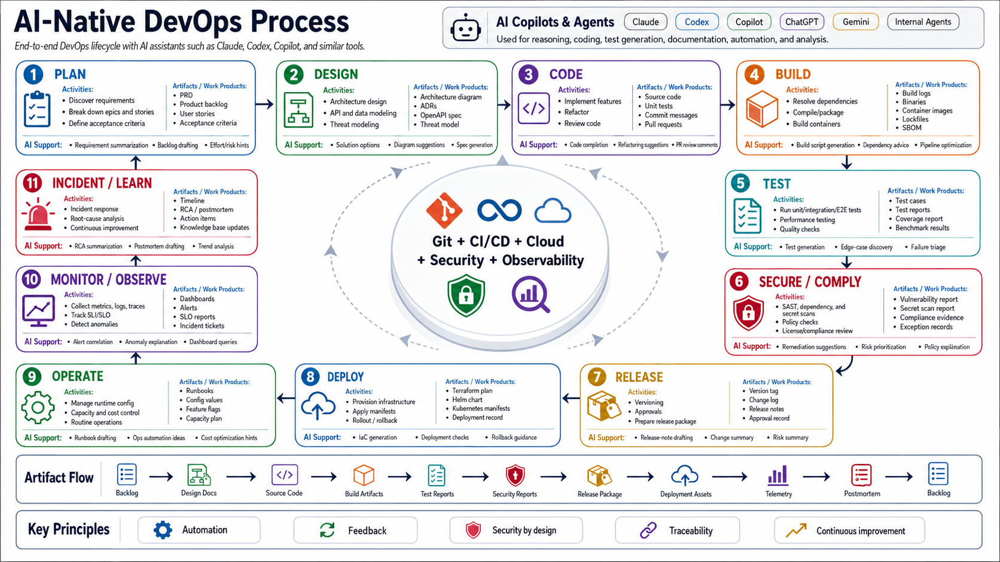

# DevOps Lifecycle Guidelines

This section contains detailed guidance for each AI-native DevOps phase.

## Lifecycle

1. [PLAN](01-plan.md)
2. [DESIGN](02-design.md)
3. [CODE](03-code.md)
4. [BUILD](04-build.md)
5. [TEST](05-test.md)
6. [SECURE / COMPLY](06-secure-comply.md)
7. [RELEASE](07-release.md)
8. [DEPLOY](08-deploy.md)
9. [OPERATE](09-operate.md)
10. [MONITOR / OBSERVE](10-monitor-observe.md)
11. [INCIDENT / LEARN](11-incident-learn.md)

