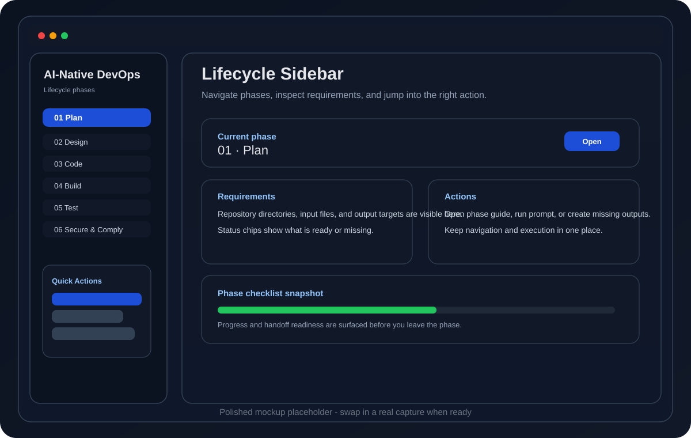
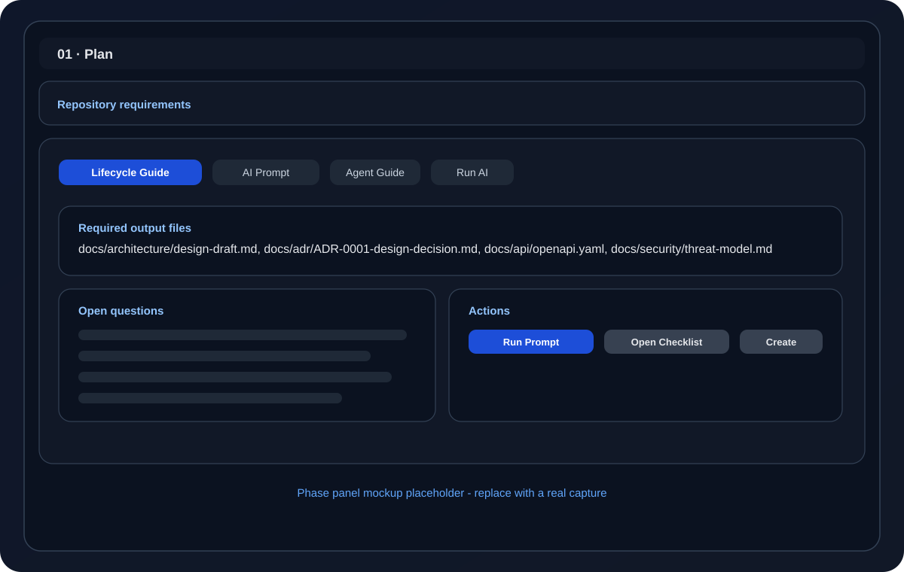
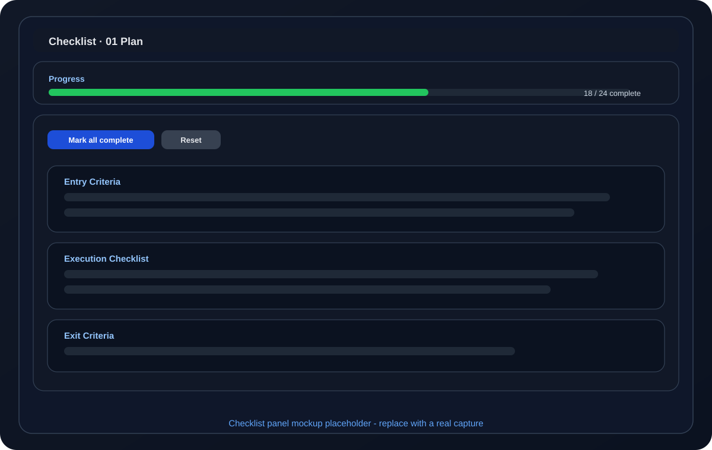

# AI-Native DevOps

An AI-assisted DevOps companion for VS Code that guides teams through PLAN to INCIDENT / LEARN with readable phase guides, checklist-driven execution, and policy-aware automation.

## At a Glance

- Lifecycle navigation for all 11 phases.
- AI prompt, agent, and checklist views in one place.
- One-click scaffolding for required output files.
- Webhook-driven automation for issue intake, CI failures, and PR routing.
- Claude, OpenAI, and GitHub Copilot provider support.

## Why Teams Use It

- Keeps planning, implementation, validation, release, and incident learning aligned.
- Reduces context switching by surfacing the right prompt and checklist for each phase.
- Makes required inputs and outputs explicit inside the UI.
- Supports policy-controlled automation instead of unsafe full automation.

## Product Tour

### 1. Lifecycle Sidebar

Open any phase from the AI-Native DevOps sidebar and jump directly into the associated guide, prompt, agent, and checklist.

### 2. Phase Webview

Review repository requirements, inspect documentation, run AI prompts, and create missing output files without leaving the panel.

### 3. Checklist Panel

Track phase readiness with section-level progress, quick actions, and a clear visual completion state.

### 4. Automation Workflows

Use the included webhook workflows and issue routing helpers to connect GitHub events to lifecycle phases.

## Screenshots

Replace these placeholders with captured VS Code screenshots from the extension itself.

| Lifecycle Sidebar | Phase Panel | Checklist Panel |
|---|---|---|
|  |  |  |

### Updating These Images

1. Capture the sidebar, phase panel, and checklist panel in VS Code.
2. Save the final images in `media/` with the suggested file names from `media/README.md`.
3. Replace the placeholder SVG files or swap the image links in this table.
4. Keep the captures dark-theme friendly and avoid cropping controls or status text.
5. Repackage the extension after updating the README assets if you are preparing a release.

## Demo

Short demo video or animated GIF placeholder.

- Suggested file: `media/demo.gif`
- Suggested caption: Lifecycle navigation, prompt execution, and checklist progress in one workflow.

## Highlights

- Accessible tabbed webviews with keyboard support.
- Clear requirement cards that show what to read and what to create.
- One-click creation of missing required outputs.
- Checklist quick actions for faster phase handoff.
- GitHub issue draft automation with dry-run and verbose preview modes.

## Commands

The extension contributes these main commands:

- Open Phase Guide
- Run AI Prompt for Phase
- Open Phase Checklist
- Open AI DevOps Dashboard
- Select AI Provider
- Run Custom Prompt
- Run Agent Automation Flow
- Scaffold Agent Artifacts
- Process Webhook Queue
- Generate CODE Agent PR Draft
- Scaffold GitHub Webhook Workflows

## Requirements

- VS Code `^1.85.0`
- GitHub CLI for issue automation workflows
- Optional Anthropic or OpenAI API keys if you are not using GitHub Copilot

## Installation

Install the packaged VSIX from the repository releases or open the `vscode-extension` folder in VS Code and run the extension locally.

## Getting Started

1. Open the AI-Native DevOps sidebar.
2. Pick a lifecycle phase.
3. Review the guide and requirements.
4. Open the checklist.
5. Run AI-assisted actions or scaffold missing outputs.

## Validation And Quality

- Phase panels render the repository requirements directly from the normalized lifecycle and prompt docs.
- Checklist panels preserve progress state and provide quick completion actions.
- The extension packages into a VSIX for distribution.
- The README is structured for marketplace-style presentation with badges, screenshots, and demo placeholders.

## Documentation

- Root repository overview: [../README.md](../README.md)
- UX release note: [../docs/workflows/ui-ux-release-note.md](../docs/workflows/ui-ux-release-note.md)
- Changelog: [../CHANGELOG.md](../CHANGELOG.md)

## Support

This extension is designed for teams adopting policy-controlled AI-assisted DevOps workflows with traceability, review gates, and artifact generation.
